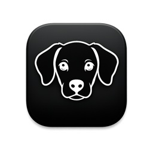
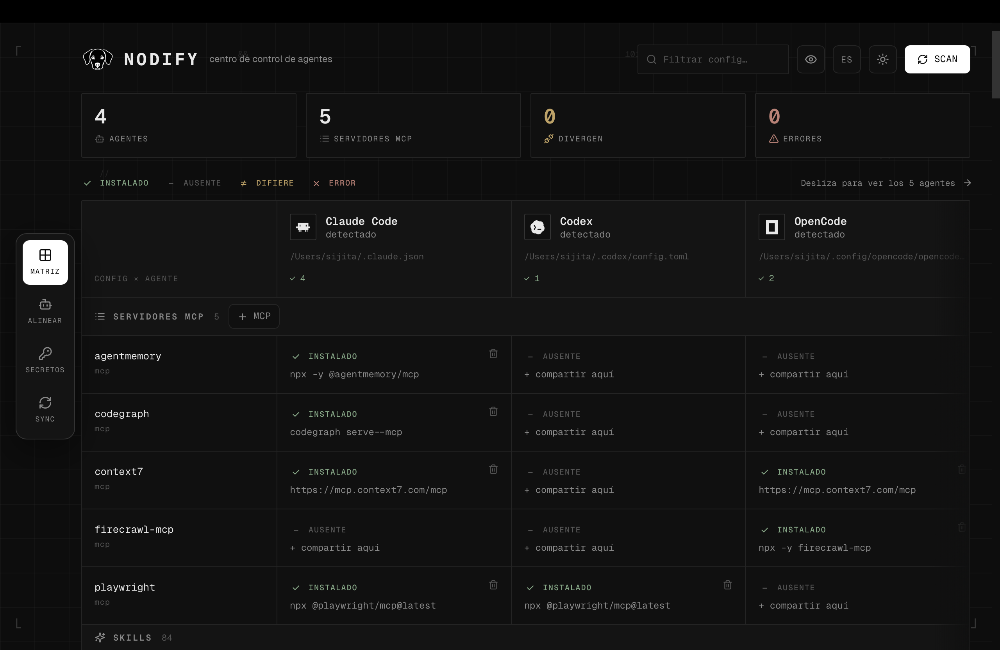

<div align="center">



# Nodify

**One panel to rule the configuration of all your AI coding agents.**

[](https://github.com/sijita/nodify/releases/latest)
&nbsp;·&nbsp;
🌐 Léelo en [Español](README.md)

</div>

<p align="center">
  
</p>

---

Nodify is a desktop app that detects, reads and edits —safely— the configuration of
**Claude Code**, **Codex**, **OpenCode**, **Kilo Code** and **Pi** from a single place: their
MCPs, their Skills, their default model, their rules, their providers and their API keys. And it
**syncs them across your devices** via a Git repository.

Built with **Tauri v2** (native window), a GUI-less **Rust core** (headless-testable) and a
**React + TypeScript frontend** with a monochrome retro/hacker design system, bilingual (ES/EN)
and with a light/dark theme.

---

## Table of contents

- [Download](#download)
- [The problem](#the-problem)
- [Key features](#key-features)
- [Interface](#interface)
- [Supported agents and compatibility](#supported-agents-and-compatibility)
- [Safety guarantees](#safety-guarantees)
- [Architecture](#architecture)
- [Installation](#installation)
- [Development](#development)
- [Project structure](#project-structure)
- [Multi-device sync](#multi-device-sync)
- [FAQ](#faq)
- [Roadmap](#roadmap)
- [Conventions and contributing](#conventions-and-contributing)
- [License](#license)

---

## Download

Grab the installer for your system from the **[latest release](https://github.com/sijita/nodify/releases/latest)**:

| System | File |
| --- | --- |
| **macOS** (Apple Silicon) | `Nodify_*_aarch64.dmg` |
| **macOS** (Intel) | `Nodify_*_x64.dmg` |
| **Windows** | `Nodify_*_x64-setup.exe` or `Nodify_*_x64_en-US.msi` |
| **Linux** | `Nodify_*_amd64.AppImage`, `*_amd64.deb` or `*.x86_64.rpm` |

> **First launch (unsigned app):** the installers aren't code-signed/notarized yet.
> - **macOS:** if you see *“Nodify is damaged”*, remove the quarantine flag with
>   `xattr -dr com.apple.quarantine /Applications/Nodify.app` and open it. (On Apple Silicon,
>   *right-click → Open* does not fix that specific message.)
> - **Windows:** SmartScreen → *More info → Run anyway*.

Prefer to build it yourself? See [Installation](#installation).

---

## The problem

Every AI coding agent stores its configuration in a different format, at a different path:

| Agent       | Location                         | Format        |
| ----------- | -------------------------------- | ------------- |
| Claude Code | `~/.claude.json`, `~/.claude/`   | JSON          |
| Codex       | `~/.codex/config.toml`           | TOML          |
| OpenCode    | `~/.config/opencode/opencode.json(c)` | JSON / JSONC |
| Kilo Code   | `~/.config/kilo/kilo.jsonc`      | JSONC         |
| Pi          | `~/.pi/agent/mcp.json`, `~/.pi/agent/settings.json` | JSON |

If you use more than one, keeping the same MCP, the same Skill or the same model across all of
them is manual work, error-prone and hard to replicate between machines. Nodify solves exactly
that: **it reads each native format, translates it to a common model, and writes it back
preserving what it doesn't understand.**

---

## Key features

### 🔌 MCPs (Model Context Protocol servers)
- **Status matrix**: rows = MCP, columns = agents, cell = installed / missing / diverging.
- **Detail modal**: clicking any cell opens a panel with the full MCP config (transport,
  endpoint/command, status, referenced env vars, agents it is present in).
- **Install** an MCP on an agent (modal: stdio or HTTP, args, env vars, headers with a key/value pair editor).
- **Remove** an MCP (with confirmation).
- **Share**: copy an MCP from one agent to another **translating the format** automatically
  (e.g. `command` string ↔ array, `env` ↔ `environment`, `Authorization` header ↔ `bearer_token_env_var`).

### 🧩 Skills
- Skill discovery (`SKILL.md` with frontmatter) in each agent's directories.
- **Detail modal**: clicking a cell shows the description from frontmatter and the full `SKILL.md` content.
- **Share** a Skill (recursive folder copy) and **remove**.
- **Agent visibility**: hide or show columns (agents) via a toggle in the top bar.
  View-only — Nodify keeps reading and writing the hidden agent's config normally.

### ⚙️ Per-agent config
- **Default model**: read and edit, with divergence detection across agents.
- **Rules** (`CLAUDE.md` / `AGENTS.md`): editor built into the detail panel.
- **Providers**: read id / name / `base_url` and the **env var name** of the key
  (never the value).

### 🔑 API keys / Secrets
- **SECRETS** view that aggregates all referenced env var names (from MCPs and providers)
  and shows which agents use each one.
- **Set-and-propagate**: writes the value where the agent supports it (Claude, in `settings.json → env`).
  Codex/OpenCode read from the shell or `auth.json`, which Nodify **never touches**.
- Nodify **does not store** secret values (see [ADR-0004](docs/adr/0004-secrets-passthrough-masked.md)).

### ⚖️ Alignment (ALIGN)
- Pick an agent as the **source of truth** and **propagate** its MCPs, skills and model to the
  rest with one click (per agent or "align all").
- Shows a **change plan** per target (`+`/`~` mcps, `+` skills, `~` model) before applying,
  with a global sync-status bar.
- It is **additive**: it never removes what a target already has. It resolves, in bulk, the
  divergences that the matrix only exposes.

### 🔄 Multi-device sync
- Exports a **canonical bundle** (with secrets converted to env var references, never values).
- `push` / `pull` over a Git repository to replicate your configuration across machines.
- Preview **diff** (`+` added, `-` removed, `~` changed) before applying.

---

## Interface

Monochrome "ink-on-paper" design system, retro/hacker but modern:

- **Light / dark theme** with a toggle (☾/☀), persisted.
- **Bilingual ES/EN** with a toggle in the top bar: lightweight in-house i18n (Zustand + typed
  dictionaries), detects the browser language and saves your preference.
- **Official agent logos** (via [simple-icons](https://simpleicons.org), [svgl.app](https://svgl.app)
  and [LobeHub](https://lobehub.com/icons), monochrome with `currentColor`) for Claude Code, Codex,
  OpenCode, Kilo Code and Pi.
- **Reorderable, hideable columns**: choose which agents to show and in which order (▲▼ arrows in
  the agents menu). With many agents the matrix scrolls horizontally while the first column stays
  pinned. It's a view-only preference: Nodify keeps reading/writing normally.
- **Animations** — subtle and snappy — with [`motion`](https://motion.dev) (Framer Motion): sliding
  dock, section transitions, matrix cells that "pop" on mutation, the ALIGN panel cascade, the SCAN
  button. Respects `prefers-reduced-motion`.
- **In-house shadcn-style dialogs** (confirm/prompt) instead of the browser's native ones.
- **Browser preview**: outside the native app there is a mutable mock, so the whole UI and its
  actions are navigable without a backend (`npm run dev`).

---

## Supported agents and compatibility

Not all agents support the same fields. Nodify translates what it can and preserves what it
doesn't understand. Summary (detail in [docs/canonical-model.md](docs/canonical-model.md)):

| Capability                | Claude Code | Codex | OpenCode | Kilo Code | Pi |
| ------------------------- | :---------: | :---: | :------: | :-------: | :-: |
| stdio MCPs                | ✓           | ✓     | ✓        | ✓         | ✓  |
| HTTP/SSE MCPs             | ✓           | ✓\*   | ✓        | ✓         | ✓  |
| Default model             | ✓           | ✓     | ✓        | ✓         | ✓  |
| Rules (memory)            | ✓ `CLAUDE.md` | ✓ `AGENTS.md` | ✓ `AGENTS.md` | ✓ `AGENTS.md` | ✓ `AGENTS.md` |
| Providers (read)          | —           | ✓     | ✓        | —         | —  |
| Write API key value       | ✓ `settings.env` | shell/`auth.json` | shell/`auth.json` | shell | shell |
| Skills                    | ✓           | ✓     | ✓        | ✓         | ✓  |

\* Subject to the agent's version/support; see [docs/adapters/](docs/adapters/).

---

## Safety guarantees

Nodify writes to files you didn't create. These are the rules that make it safe, encoded as ADRs:

- **In-place editor, no source of truth of its own** ([ADR-0002](docs/adr/0002-editor-in-place-no-source-of-truth.md)):
  each agent's native files are the single source of truth. Nodify has no parallel database that
  could drift out of sync.
- **Surgical writes** ([ADR-0005](docs/adr/0005-surgical-writes-preserve-unknown.md)):
  every write **preserves unknown fields, order and comments**, makes a **backup** and uses an
  **atomic replace** (write to a temp file + `rename`). Claude uses `serde_json` with
  `preserve_order`; Codex uses `toml_edit` (keeps comments); OpenCode does a text *splice* over
  the `mcp` block so it never loses JSONC comments.
- **Passthrough, masked secrets** ([ADR-0004](docs/adr/0004-secrets-passthrough-masked.md)):
  values are sent to the webview **already masked**; Nodify does not store them; the sync bundle
  reduces them to env var references. `auth.json` is never read or written.
- **GUI-less core** so the domain logic can be tested exhaustively and headless.

---

## Architecture

### Canonical model + adapters

The heart of Nodify ([ADR-0003](docs/adr/0003-canonical-model-with-adapters.md)) is a neutral
**canonical model** (`CanonicalMcp`, `CanonicalSkill`, `SecretValue`, `Transport`…) and an
`Adapter` trait that each agent implements to translate **native ↔ canonical**:

```
                     ┌──────────────────────────────┐
   native file       │        Adapter trait         │    canonical model
  (JSON/TOML/JSONC)  │  parse_mcps / upsert_mcp     │   (neutral, common)
        ───────────▶ │  parse_model / set_model     │ ───────────▶  UI / Sync
        ◀─────────── │  parse_providers / set_env   │  ◀───────────
   (surgical         │  remove_mcp                  │
    write)           └──────────────────────────────┘
             claude.rs · codex.rs · opencode.rs · kilocode.rs · piagent.rs
```

Adding a new agent = writing **one** adapter; nothing else changes.

### Rust crates (workspace, GUI-less)

```
crates/
  nodify-core/      # pure domain: canonical model + Adapter trait + sync bundle
  nodify-adapters/  # one Adapter implementation per agent + ops (share/find)
  nodify-io/        # path detection, safe writes (backup+atomic), skill scanning
```

> `src-tauri/` is **deliberately excluded** from the Cargo workspace. It depends on webkit/GUI, and
> excluding it lets `cargo test --workspace` run the whole core in CI/headless without pulling in
> graphical dependencies. The shell consumes the crates by *path*.

### Full flow

```
  React (features/)  ──invoke──▶  Tauri commands (src-tauri/src/mutate.rs)
        ▲                              │
        │ SWR                          ▼
        │                        nodify-adapters ──▶ nodify-core (canonical)
        └──── AgentScan JSON ◀──  nodify-io (detects paths, safe_write)
```

- **Frontend**: React 19 + Vite 6 + Tailwind v4 + shadcn-style components (CVA) + SWR
  (fetching/cache) + Zustand (navigation and language) + `motion` (animations) + `simple-icons`
  (logos) + Biome (lint/format).
- **Outside Tauri** (browser preview) there is a **mutable mock**: all actions (install, remove,
  share, model, skills, rules, align, export) work on demo data, so you can see the UI without a
  backend.

### Architecture decisions (ADRs)

| ADR | Decision |
| --- | --- |
| [0001](docs/adr/0001-desktop-app-tauri.md) | Desktop app with Tauri |
| [0002](docs/adr/0002-editor-in-place-no-source-of-truth.md) | In-place editor, no source of truth of its own |
| [0003](docs/adr/0003-canonical-model-with-adapters.md) | Canonical model + adapters |
| [0004](docs/adr/0004-secrets-passthrough-masked.md) | Passthrough masked secrets |
| [0005](docs/adr/0005-surgical-writes-preserve-unknown.md) | Surgical writes (preserve the unknown) |
| [0006](docs/adr/0006-github-sync-canonical-bundle.md) | Sync via canonical bundle on GitHub |
| [0007](docs/adr/0007-canonical-mcp-translation-rules.md) | MCP translation rules across agents |

---

## Installation

### Requirements

- **Rust** (stable) — [rustup.rs](https://rustup.rs)
- **Node 20+** and npm
- **Tauri OS prerequisites** — see [tauri.app/start/prerequisites](https://tauri.app/start/prerequisites/).
  On Linux you need **`webkit2gtk-4.1`** (Tauri v2). ⚠️ **Ubuntu 20.04 only ships `webkit2gtk-4.0`**,
  so the native window won't compile there; use Ubuntu 22.04+, macOS or Windows for the native app.
  (The Rust core and the frontend preview do run anywhere.)

### Build the native app

```bash
git clone https://github.com/sijita/nodify.git
cd nodify
npm install

# Generate the icons once (required by Tauri):
npx tauri icon nodify_logo.png      # creates src-tauri/icons/

npm run tauri dev     # development (hot-reload)
npm run tauri build   # production binary/installer
```

> The first time you run the native app against your real files, follow the checklist in
> [SMOKE-TEST.md](SMOKE-TEST.md): it backs up first and verifies each write from the terminal.

---

## Development

```bash
# ── Rust core (no GUI required) ──
cargo test --workspace                              # ~44 domain tests
cargo clippy --workspace --all-targets -- -D warnings
cargo run -p nodify-adapters --example scan         # scans YOUR real agents (read-only)

# ── Frontend ──
npm install
npm run dev        # Vite at http://localhost:1420 (preview with mutable DEMO data)
npm run build      # tsc + vite build
npm run lint       # biome check
npm run format     # biome format --write

# ── Full app (Tauri) ──
npm run tauri dev
```

> **Tip:** `cargo run -p nodify-adapters --example scan` is the fastest way to check, risk-free,
> that Nodify correctly detects and parses your agents' real config (read-only).

---

## Project structure

```
nodify/
├── crates/                     # Rust core (headless workspace, testable)
│   ├── nodify-core/            #   canonical model, Adapter trait, sync bundle
│   ├── nodify-adapters/        #   claude.rs · codex.rs · opencode.rs · kilocode.rs · piagent.rs · ops.rs
│   └── nodify-io/              #   detect.rs (paths) · write.rs (safe_write) · skills.rs
├── src-tauri/                  # Tauri shell: commands exposing the core (mutate.rs, scan.rs)
├── src/                        # React frontend (screaming architecture by feature)
│   ├── app/                    #   layout, dock-nav, grid-background, top-bar, logo, theme
│   ├── assets/                 #   brand logos (light/dark)
│   ├── components/             #   ui/ (button, card, input, badge, dialog…) · agent-glyph
│   ├── features/               #   mcps/ · agents/ (ALIGN + drawer) · secrets/ · sync/
│   ├── i18n/                   #   language store + dictionaries en.ts / es.ts
│   └── lib/                    #   tauri.ts (wrappers) · mock.ts · types.ts · agents.ts
├── public/                     # favicon / app icon
├── docs/                       # canonical-model, adapters/, adr/, design-system
├── CONTEXT.md · PRD.md · PLAN.md · CONVENTIONS.md · SMOKE-TEST.md
└── Cargo.toml · package.json · vite.config.ts · biome.json
```

---

## Multi-device sync

Nodify can replicate your configuration across machines through a Git repo
([ADR-0006](docs/adr/0006-github-sync-canonical-bundle.md)):

1. **Export**: generates a *canonical bundle* with MCPs, models and skills from all agents.
   Secrets are reduced to **env var references** — no values are ever written to the bundle.
2. **Push**: writes the bundle to the repo and runs `git add/commit/push`.
3. **Pull**: `git pull --ff-only` and **applies** the bundle to the local agents (surgical write).
4. **Diff**: before applying, you see what changes (`+` / `-` / `~`).

In the browser preview the bundle can be exported (demo); `push`/`pull` require the native app
+ `git` installed.

---

## FAQ

**Can Nodify corrupt my configs?**
Every write backs up first, is atomic (temp + `rename`) and preserves fields and comments it
doesn't recognize. The logic is covered by tests that include round-trips.

**Does it store my API keys?**
No. Values travel masked to the UI and are only written to the file of the agent that supports
them (Claude `settings.env`). There is no store or vault; `auth.json` is never touched.

**Why doesn't the native window run on my Ubuntu 20.04?**
Tauri v2 requires `webkit2gtk-4.1` and Ubuntu 20.04 only provides `4.0`. Use 22.04+, macOS or
Windows. The core and the frontend preview work the same on any OS.

**How do I add support for another agent (Cursor, Gemini CLI…)?**
Implement the `Adapter` trait in a new file inside `nodify-adapters` and register it in `all()`.
The rest of the system (UI, sync, safe writes) consumes it with no changes.

**Do I need all the agents installed?**
No. Nodify detects the ones you have present and shows the rest as missing. You can hide the
ones you don't use from the agents menu.

---

## Roadmap

Done (MVP, phases 0–5): read + write of MCPs, Skills, model, rules, providers, API keys,
cross-agent alignment and Git sync; plus i18n (ES/EN), light/dark theme and branding.
See [PLAN.md](PLAN.md).

Post-MVP (backlog):

- Curated MCP catalog/registry.
- Enable/disable Skills via each agent's native mechanism.
- Encrypted secrets vault (OS keychain).
- Declarative state + *drift* detection + history/rollback.
- Project scope (local `.claude/`, per-project rules).
- More agents: Cursor, Gemini CLI, Cline…

---

## Conventions and contributing

- **Screaming architecture** (folders by feature), **TDD** in the core, **Conventional Commits**.
- Before a PR: `cargo test --workspace`, `cargo clippy … -D warnings`, `npm run lint`, `npm run build`.
- Full details in [CONVENTIONS.md](CONVENTIONS.md).

---

## License

MIT.
